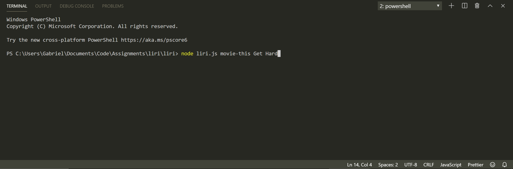
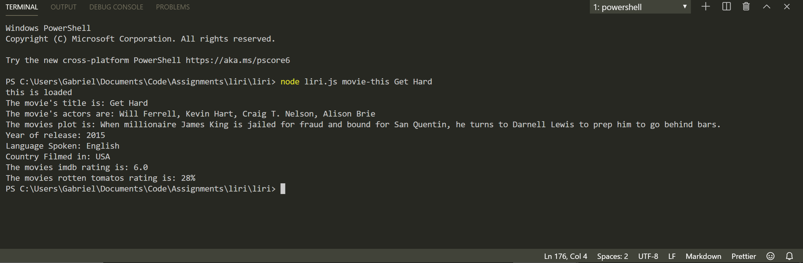

# LIRI

LIRI is like iPhone's SIRI. However, while SIRI is a Speech Interpretation and Recognition Interface, LIRI is a _Language_ Interpretation and Recognition Interface. LIRI will be a command line node app that takes in parameters and gives you back data.

#  Bands In Town API
### `node liri.js concert-this <artist/band name here>`

  * This will search the Bands in Town Artist Events API for an artist you search and render the following information about each event to the terminal:

 * Name of the venue

 * Venue location

 * Date of the Event 

# Spotify API 
### `node liri.js spotify-this-song '<song name here>'`
* This will show the following information about the song in your terminal/bash window

     * Artist(s)

     * The song's name

     * A preview link of the song from Spotify

     * The album that the song is from

   * If no song is provided then your program will default to "All of me" by John 

# OMDB API
### `node liri.js movie-this '<movie name here>'`

   * This will output the following information to your terminal/bash window:

     * Title of the movie.
     * Year the movie came out.
     * IMDB Rating of the movie.
     * Rotten Tomatoes Rating of the movie.
     * Country where the movie was produced.
     * Language of the movie.
     * Plot of the movie.
     * Actors in the movie.
     
# How to Enter Commands 
* Within the terminal the command syntax must look like as follows:
node liri.js "YOURE COMMAND HERE" "YOUR ARTIST/MOVIE NAME/SONG TITLE HERE"

* example: This example is using the movie-this command, change your command to fit your use case

terminal command input screenshot:

terminal result screenshot:

